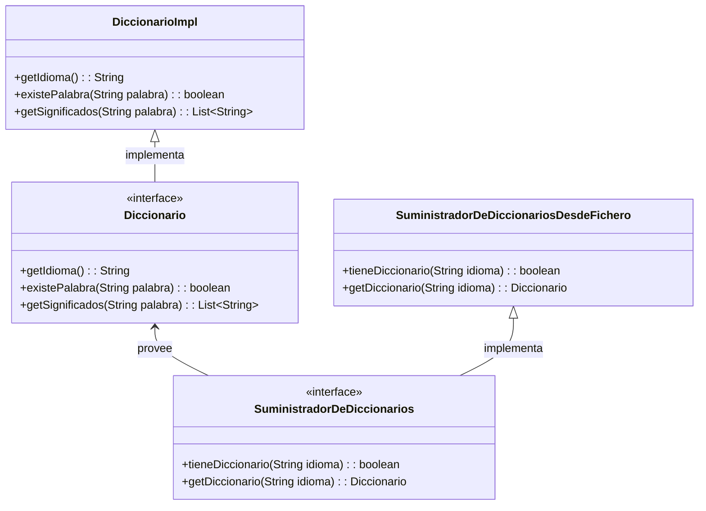

# Mundo WEB

WEB != INTERNET

Internet es un conjunto de redes descentralizadas que se conectan entre sí.
Web es un servicio que se ejecuta sobre Internet.
Otros servicios: Email, VozIP, FTP, juegos online, TV online, etc.

WEB: Tim Berners-Lee, 1989:
- Protocolo HTTP
- Lenguaje HTML: Permite estructurar documentos basándose en su aspecto visual
  - párrafos
  - listas numeradas
  - tablas
  - imágenes
  - enlaces

El mundo web no es sino una arquitectura cliente-servidor:
Cuando no teníamos redes, los programas se ejecutaban en un solo ordenador.
Con la aparición de las redes, los programas pudimos empezar a dividirlos en dos partes:
- Cliente: Interfaz gráfica
- Servidor: Datos -> Lógica de negocio + Datos
Al tener 2 partes en un programa necesito establecer una comunicación entre ellas:
- Mensaje (Irá codificado en un lenguaje)
- Protocolo (Conjunto de reglas que definen cómo se establece la comunicación)

Ventajas: 
- Centralización de los datos = COMPARTIR
- Centralización de la lógica de negocio 
- Empezamos a necesitar clientes más ligeros
Complicaba un poco el desarrollo: Era necesario en cada desarrollo tener en cuenta la comunicación entre cliente y servidor:
- Definir el protocolo
- Definir el lenguaje de codificación

El mundo web estandardizó esas 2 cosas:
- Lenguaje de codificación: HTML
    HTML es un lenguaje de dominio específico que se utiliza para estructurar documentos web orientados a su representación visual.
- Protocolo: HTTP


Fué bien la cosa... pero se empezó a quedar pequeño... y evolucionó:
PAGINAS WEB -> APLICACIONES WEB

Al principio del mundo web, las páginas web eran estáticas:
Los desarrolladores creaban documentos HTML estáticos que dejarían en un servidor web.

Pero empezamos a ver la necesidad y utilidad de generar contenido dinámico:
De forma que los desarrolladores en lugar de crear páginas web estáticas, creaban programas que generaban páginas web. En ese proceso de generación de páginas web, se podía tener en cuenta la información que el usuario proporcionaba, información que se almacenaba en una base de datos, etc.

- php (processor hypertext)
- java (J2EE -> JEE: jsp, servlets)
- asp (Active Server Pages)

Los servidores web, se volvieron un poco más listos:
Ya no sólo debían servir páginas web estáticas, sino que debían ser capaces solicitar a programas custom la generación de páginas web dinámicas. Capturar la salida de esos programas (HTML) y enviarla al cliente.

En este mundo JAVA se hizo el REY. Y comenzaron a aparecer un montón servidores de aplicaciones que se encargarían de la ejecución de esos programas custom servlets, jsps...

Esas aplicaciones web, que montábamos... comenzaron a hacerse más y más complejas: EMPEZAMOS A USAR ARQUITECTURAS MONOLÍTICAS para montar esos sistemas... Y ésto estaba bien visto!

VOY A HACER UN SISTEMA QUE HAGA DE TODO. Y ASI AL HACER DE TODO Y TENER TODO EN UN MISMO SITIO, TODO ESTARÁ MÁS CONTROLADO Y SERÁ MÁS FÁCIL DE GESTIONAR ... o eso pensábamos = CAGADA !

Problema: al final acabamos con sistemas enormes, con un mantenimiento poco más que dudoso... y con un montón de problemas de escalabilidad, rendimiento, etc.

En paralelo con esto, para gestionar esos proyectos, lo que usábamos eran las famosas metodologías en cascada (hoy en día, las llamamos metodologías tradicionales). Y BIEN FELICES QUE LAS USÁBAMOS!

Hoy en día las paredes de las oficinas están empapeladas con POSTITs... Antaño, las paredes de las oficinas estaban empapeladas con diagramas de GANTT.
La de horas que metíamos los jefes de proyecto en hacer diagramas de GANTT.

Con el tiempo, nos dimos cuenta también que esas metodologías en cascada no eran la panacea... y que había que evolucionar. Y aparecieron las metodologías ágiles.

LAS HERRAMIENTAS, LOS LENGUAJES, LAS ARQUITECTURAS, LAS METODOLOGÍAS... TODO EVOLUCIONA EN PARALELO, para resolver los problemas que nos vamos encontrando en un momento dado del tiempo.
No puedo sacarlos de esa ecuación.

PROBLEMAS con los que nos encontrábamos en esa época:
- Arquitecturas monolíticas:
  - Daban lugar a sistema muy grandes y complejos
  - Dificultad para mantenerlos
  - Dificultad para evolucionarlos
  - Dificultad para operarlos
- Metodologías en cascada: En la práctica resultaba que:
  - Ni un proyecto de software se entregaba en plazo
  - El cliente no veía nada hasta que no estaba todo terminado (alguna mini demostración)
    - Cuando se encontraba el sistema = FIESTA !!!
      - Cámbiame esto
      - Eso no me vale
      - Necesito esto otro
- Patrones de diseño y en general, la forma en la que escribíamos el código: 
    Las empresas se dan cuenta (A BASE DE OSTIAS) que montar un programa que funcione no es un un problema (al menos no el gran problema). El problema es que una vez ese software pasa a producción, se convierte en un monstruo que hay que mantener, evolucionar, operar, etc. ME COMPROMETO ... firmo una hipoteca con ese código... y esa hipoteca empieza a cobrar unos intereses que no me esperaba.

    Aparecen los Principios SOLID (año 2000). Son 5 principios que nos ayudan a montar sistemas más fáciles de mantener y evolucionar en el tiempo:
        - S: Single Responsability Principle
                Cada componente de mi sistema debe tener una única responsabilidad... y por ende una única razón para cambiar. Se puede aplicar a diversos niveles.
        - O: Open/Closed Principle
        - L: Liskov Substitution Principle
        - I: Interface Segregation Principle
        - D: Dependency Inversion Principle
      Lo único que me dan estos principios es un conjunto de reglas que SI mi código las respeta ME GARANTIZAN que mi código será más fácil de mantener y evolucionar en el tiempo.
      Eso si.. el cómo haga yo mi código para que respete esos principios... es cosa mía.
      Esto va intimanente ligado a la PROGRAMACIÓN ORIENTADA A OBJETOS. 

En paralelo aparecen nuevas necesidades:

    - En su momento:
    FRONTAL WEB            -> BACKEND
    Navegador  <--- html ---- Monolito

    Hoy en día:
    FRONTAL                                                                   -> BACKEND
    - web (JS: Generar HTML directamente en el navegador)          
    - app nativa iOS                                         <- json, xml        App
    - app nativa Android
    - Asistente de voz (alexa, google home, siri)
    - IVR (Interactive Voice Response)
    - App. escritorio

    Las apps web antiguas eran infumables... era muy muy muy poco ergonómicas. Nada interactivas.
    Y lentas... para aburrir.

    - Y empiezan a salir nuevos estándares: WEB COMPONENTS (estándar de la W3C - creada por Tim Berners-Lee)
    Para permitir la creación de un nuevo tipo de aplicaciones web: SPA (Single Page Application)
    Donde ya no tengo decenas o cientos de documentos HTML (generados estáticamente o dinámicamente) sino que tengo un único documento HTML que se va modificando dinámicamente (que va mutando).
    De forma que tengo programas JS que piden datos al servidor y al recibirlos generan trozos de HTML en el navegador que se inyectan o reemplazan a otros en el documento HTML.

    - Necesitamos empezar a conectar programas entre si, programas que no están en el mismo servidor: B2B: Quiero que un proveedor me envíe un fichero con los pedidos que me han hecho o quiero que un cliente me envíe un fichero con los pedidos que me han hecho.
    Y nos aprovechamos de esa infraestructura:
      - Arquitectura WEB
        - Protocolo HTTP
        - Pero... el HTML se me me queda cojo.. y necesito otros formatos de intercambio de datos más limpios (sin contaminar por toda la parafernalia de HTML que va orientada a la representación visual): JSON, XML
      - Frameworks de desarrollo JEE
      - Servidores de aplicaciones
  
    Surge el concepto de Servicios WEB y las arquitecturas orientadas a servicios (SOA).
    Se impone el uso del lenguaje XML para transmitir datos entre aplicaciones. Empiezan a salir estándares para definir servicios web: SOAP, WSDL, UDDI.
    INFUMABLE!!!! Se vuelve todo muy complicado. PERO ESTABAMOS EMOCIONADOS CON NUESTRO PURITANISMO TECNOLÓGICO.

    - Empieza un mundo donde cada vez tenemos transacciones más grandes, más complejas, más críticas, más sensibles a la latencia, más sensibles a la disponibilidad, más sensibles a la seguridad... más datos... Y arranca una tendencia nueva: JSON (mucho más ligero que el XML)


# Single Responsability Principle

Imaginad que quiero montar ua aplicación de consola que dada una palabra y un idioma, me indique los significados de esa palabra en ese idioma.
    $ significados ES melocotón

Cuántos módulos/subproyectos/repositorios de git monto para esa aplicacioncita?
Cuántos archivos .jar quiero???
- FRONTAL CONSOLA: Responsabilidad: Interacción con el usuario
- BACKEND: Gestión de diccionarios (BBDD, Fichero,..)
- API de comunicación entre ambos: Establecer la FORMA en la que se comunican ambos módulos

Montado así, podría por ejemplo:
- Podría cambiar el día de mañana la forma en la que interactúo con el usuario (de consola a web)
  Desde luego sería más sencillo que si tuviera en mi código una función que se encarga de : HAcer preguntas al usuario por pantalla en la línea 1, leer un fichero de palabras en la línea 2, buscar en el diccionario en la línea 3, y sacarle por pantalla en la línea 4.
- Podría cambiar sin problemas el backend (de fichero a BBDD)... Afecta en algo este cambio a la consola? NO
Puedo ir bajando de nivel y seguir aplicando el ppio de SRP: BACKEND



Responsabilidades: 
- Clase diccionario: Controlar palabras de un idioma y sus significados
- Clase SuministradorDeDiccionarios: Proveer diccionarios

Puedo seguir aplicando este principio a más bajo nivel:

Dentro de la clase Diccionario:
- getSignificados(String palabra): List<String>
  Responsabilidad: Devolver los significados de una palabra
- existePalabra(String palabra): boolean
  Responsabilidad: Indicar si una palabra existe en el diccionario 

Lo que pasa es que aquí... si planteamos solo esos 2 módulos... nos estamos cagando en otro principio SOLID: Principio de la inversión de dependencias.

## Principio de la inversión de dependencias

Un componente de software no debería depender de una implementación de otro componente de software, sino que ambos deberían depender de una abstracción (interfaz | contrato): API

Pregunta: A mi app de consola le debe de importar qué implementación de diccionario esté usando? Si es a BBDD o a fichero? NO

```java

package com.diccionarios;

public class DiccionarioImpl implements Diccionario{
    public getIdioma(): String{
        // Lo que fuere
    }
    public existePalabra(String palabra): boolean{
        // Lo que fuere
    }
    public getSignificados(String palabra): List<String>{
        // Lo que fuere
    }
}

public class SuministradorDeDiccionariosDesdeFichero implements SuministradorDeDiccionarios{
    // Los diccionarios los tengo en carpetas/archivos
    public SuministradorDeDiccionarios(String carpeta){
        // Lo que fuere
    }
    public tieneDiccionario(String idioma): boolean{
        // Lo que fuere
    }
    public getDiccionario(String idioma): Diccionario{
        // Lo que fuere
    }
}

```

```java

package com.aplicacion;

import com.diccionarios.Diccionario;
import com.diccionarios.SuministradorDeDiccionarios; 
//import com.diccionarios.SuministradorDeDiccionariosFactory;
                                                     // Y AQUI LA ACABO DE REGAR!
                                                     // Me estoy cagando en el ppo de la inversión de dependencias
                                                     // Ese import mata el proyecto
public class AppDeConsola {
    //... Hará lo que sea
    public void procesarPeticion(String idioma, String palabra, SuministradorDeDiccionarios suministrador){ // Inversión de dependencias
        if(suministrador.tieneDiccionario(idioma)){
            Diccionario diccionario = suministrador.getDiccionario(idioma);
            if(diccionario.existePalabra(palabra)){
                List<String> significados = diccionario.getSignificados(palabra);
                // Imprimir significados
            } else {
                // Imprimir que la palabra no existe
            }
        } else {
            // Imprimir que no tenemos diccionario para ese idioma
        }

    }
}
```

Un componente de software no debería depender de una implementación de otro componente de software, sino que ambos deberían depender de una abstracción (interfaz | contrato): API

```java
public class SuministradorDeDiccionariosDesdeBBDD{
    // Los diccionarios los tengo en carpetas/archivos
    public SuministradorDeDiccionarios(/*Conexion a la bbdd... usuario...*/){
        // Lo que fuere
    }
    public tieneDiccionario(String idioma): boolean{
        // Lo que fuere
    }
    public getDiccionario(String idioma): Diccionario{
        // Lo que fuere
    }
}

```

No me vale solo con cambiar ese... necesito cambiar también la AppDeConsola. VAYA MANTELIBILIDAD QUE TIENE MI PROYECTO = MONOLITO!

Hasta aquí lo que me cuenta el ppo de inversión de dependencias.

Otra cosa es cómo me aseguro yo de que mi código respeta esos principios. Echo mano de patrones de diseño:
- Patrón Factory: Me permite crear objetos sin tener que especificar la clase concreta de objeto que se creará.
- Inyección de dependencias: Me permite inyectar una dependencia en un objeto en lugar de crearla dentro del objeto.
  -> SPRING 

La idea que me subyace detrás del ppo de inversión de dependencias es definir un sistema con componentes DESACOPLADOS.

---

# Metodologías ágiles < Vienen del manifiesto ágil

La principal característica de una metodología ágil es que vamos entregando al cliente el producto de forma incremental.

Lo que se busca es involucrar al cliente en el proceso de desarrollo del software. Que el cliente vea cómo va evolucionando el software, que pueda ir probándolo, que pueda ir dándonos feedback rápido.

HITO 1: FECHA + **CONJUNTO DE REQUISITOS**: Dia 17-Sep: R1, R2, R3
    Qué pasaba si llegaba al día 17 y solo tenía el R1 y R3?
        - Voy con retraso
        - Suenan las alarmas
        - Caen ostias pa tos los laos
        - Se replaficaba el hito 17/09 -> 22/09

HITO 2: FECHA + CONJUNTO DE REQUISITOS: Dia 30-Sep: R4, R5, R6


SPRINT 1: **FECHA** + CONJUNTO DE REQUISITOS: Dia 17-Sep: R1, R2, R3
    Qué pasaba si llega al día 17 y solo tengo el R1 y R3?
        - Y LA FECHA NO SE TOCA <- La fecha es lo importante
        - PASO A PRODUCCIÓN EL R1 Y R3
        - Y el R2? No pasa nada... al siguiente sprint
    AQUI PASO A PRODUCCION: Y eso su tiene sus implicaciones:
        - Pruebas a nivel de PASO A PRODUCCION
          - Aquí pruebo el R1 y R3... y R2 (que ha fallao y por eso no entrego el R2)
          - Instalación en un entorno de pruebas
        - Instalación en el entorno de producción (es complicao: BBDD, Colas de mesajería, otros componentes)

SPRINT 2: FECHA + CONJUNTO DE REQUISITOS: Dia 30-Sep: R4, R5, R6 (+R2)

Sprint -> Implica entrega al cliente!
          El hito no la implicaba
          Con los sprints... planifico el siguiente.. No hago el capullo como con los hitos en los diagramas de GANTT que planificaba del primero al último el día 0.
    AQUI PASO A PRODUCCION: Y eso su tiene sus implicaciones:
        - Pruebas a nivel de PASO A PRODUCCION
          - R2 + R4 + R5 + R6? En cualquier caso he hecho cambios en el código y debo asegurar que: R1 y R3 siguen funcionando
          - Instalación en un entorno de pruebas
        - Instalación en el entorno de producción (es complicao: BBDD, Colas de mesajería, otros componentes)

HAY UNA PEQUEÑA CUESTION... que no me cuentan en los cursos de SCRUM... 

Si tengo un sistema monolítico... es desgajar unos cambios de otros no es evidente, ni sencillo.. ya que un cambio impacta demasiado en el resto del sistema. O me voy a una arquitectura con componentes desacoplados o gestionar estos cambios va a ser muy complicado. Cambios sobre la marcha: HOY DECIDO QUE MAÑANA no paso el R2 a producción (esto tiene a su vez un impacto enorme en la forma en la que usamos los sistemas de control de código fuente - git)

Cuándo usábamos met. tradicionales... cuántas veces hacía paso a producción? En ppo 1
Y pruebas? Al acabar el desarrollo -> PROYECTO ENTRABA EN FASE DE PRUEBAS
    Previo al paso a producción

Ahora, con las metodologías ágiles... las pruebas se multiplican... y las instalaciones en entornos de pruebas y producción también.

De donde saco la pasta? y el tiempo? y los recursos? para tanta prueba y tanta instalación? NO HAY NI PASTA, NI TIEMPO, NI RECURSOS:
    - Automatización de pruebas
    - Automatización de despliegues
Porque tanto lo uno como lo otro lo vamos a hacer 50 veces.

> Extraído del manifiesto ágil:
    
    El software funcionando es la MEDIDA principal de progreso: ESTA FRASE DEFINE UN INDICADOR PARA UN CUADRO DE MANDO (1)
    La MEDIDA principal de progreso es "el software funcionando"
    Cómo vas a medir qué tal va el proyecto: Con el concepto: "el software funcionando"
    Qué cojones es el concepto: "software funcionando"? Software que funciona.
    Quién dice que el software funciona? 
        - EL CLIENTE: NI DE COÑA. Al cliente le debe llegar uin producto que funcione!
        - LAS PRUEBAS!
  Por eso, hoy en día, cuando uso una metodología ágil, para saber cómo va el proyecto lo que miro es cuántas pruebas se han superado en una unidad de tiempo.

    Y quiero las pruebas ejecutándose de continuo, para saber en tiempo real, qué tal va el proyecto! 
    Eso al menos si quiero decir que estoy usando una metodología ágil.

---

## DEVOPS

Es una cultura, es una filosofía, es un movimiento en pro de la automatización en todos los pasos de la construcción de un software desde el DEV -> OPS

                                    Automatizable?      Herramientas
PLAN                                    POCO
CODE                                    POCO
BUILD                                   SI
                                                            Java: Maven, Gradle, Sbt (ANT)
                                                            .net: MSBuild, dotnet, nuget
                                                            JS: npm, yarn, webpack
------------ Si consigo en un proyecto automatizar hasta aquí se llama --------> DESARROLLO AGIL!
                                                                            código en git + empaqueto con maven.
TEST
    Diseño de la prueba                 POCO
    Ejecución de la prueba              SI
                                                            Selenium, cypress, karma, katlon
                                                            appium, espresso, xctest
                                                            JMeter, loadrunner
                                                            JUnit, NestNg, Jest, Jazmine, NUnit, Unittest
                                                            SonarQube, Jacoco, Cobertura

    Me fio de las pruebas que ejecute un desarrollador en su máquina?   NADA. Su entorno está maleao.
    Me fio de las pruebas que ejecute un tester en su máquina?          MISMA MIERDA !
    Me fio de las pruebas que hago en un entorno que cree específicamente para pruebas?  NI ESO YA!!!!
    HOY EN DIA, la tendencia es a generar entornos de pruebas de usar y tirar: SIEMPRE LIMPIO.
        Y a automatizar las pruebas en esos entornos.
        Y claro... necesito automatizar también la generación de esos entornos de pruebas.
    Al final, un entorno de pruebas precreado el día 1 del proyecto, después de 50 instalaciones acaba MALEAO!

    Y necesito automatizar la instalación de la app en esos entornos de pruebas:
        - Contenedores: Docker / Podman, Rancher, CRIO, ContainerD
        - Terraform / Vagrant
        - Ansible / Puppet / Chef                                                                               (1)
------------ Si consigo en un proyecto automatizar hasta aquí se llama -------> Integración Continua -> INFORME DE PRUEBAS EN TIEMPO REAL
    Tengo CONTINUAMENTE la última versión del código instalada en un entorno de INTEGRACION sometida a pruebas automatizadas.
RELEASE                                 SI
    Subo una versión a nexus, artifactory
    o simplemente a un directorio en red
    o a una web.
    O si monto una app movil Android -> Play Store
    O si monto una app movil iOS -> App Store
    Quiero la última versión en manos de mi cliente (él sabrá lo que hace)
------------ Si consigo en un proyecto automatizar hasta aquí se llama --------> Entrega Continua (CONTINUOUS DELIVERY)
    Tengo CONTINUAMENTE la última versión del código en manos de mi cliente
DEPLOY                                  SI
    Instalación en un entorno de producción
    Y necesito automatizar la instalación de la app en esos entornos de pruebas:
        - Contenedores: Kubernetes / Openshift... <- Todos los entornos de producción los estamos moviendo a Kubernetes
        - Terraform / Vagrant
        - Ansible / Puppet / Chef
------------ Si consigo en un proyecto automatizar hasta aquí se llama --------> Despliegue Continuo (CONTINUOUS DEPLOYMENT)
    Tengo CONTINUAMENTE la última versión del código instalada en un entorno de producción
OPERATE                                 SI: KUBERNETES: Es un compi que se encarga del entorno de producción!
    - Reinicio de un servidor
    - Escalar e instalar en 10 nuevos servidores
    - Desinstalar de 5 servidores
MONITOR                                 IGUAL!
------------ Si consigo en un proyecto automatizar hasta aquí se llama --------> Adoptado una cultura DEVOPS COMPLETA!

## Entornos de producción

Qué características debe tener un entorno de producción que no son necesarias en otros entornos?
- Alta disponibilidad
    Nos referimos a TRATAR DE GARANTIZAR que el sistema esté disponible un tiempo normalmente acordado (SLA)
        90%                     | €                          36,5 días año con el sistema DOWN Blog
        99%                     | €€                         3,65 días año con el sistema DOWN Peluquería
        99,9%                   | €€€€€€€€                   8,76 horas año con el sistema DOWN Banco
        99,99%                  v €€€€€€€€€€€€€€€€€€€€€      52,56 minutos año con el sistema DOWN Hospital
        100% (no tiene sentido... las máquinas se rompen y no se cuándo)

        CLUSTER: Conjunto de servidores / procesos que ejecutan todos el mismo trabajo y si cae uno, hay más que lo pueden hacer.
- Escalabilidad
    Ajustar la infra a las demandas del sistema en cada momento

        App1: App departamental
            Día 1:      100 usuarios
            Día 100:    100 usuarios    AQUI NO NECESITO ESCALABILIDAD
            Día 300:    100 usuarios

        App2: 
            Día 1:      100 usuarios
            Día 100:    1000 usuarios    AQUI SI NECESITO ESCALABILIDAD: ESCALABILIDAD VERTICAL (MAS MAQUINA!!!!)
            Día 300:    10000 usuarios

        App3: ESTO ES EL HOY EN DIA: INTERNET
            Día n:           100 usuarios
            Día n+1:      100000 usuarios   BLACK FRIDAY
            Día n+2:        1000 usuarios                       ESCALABILIDAD HORIZONTAL (MAS MAQUINAS!!!!) O MENOS
            Día n+3:   100000000 usuarios   CIBER MONDAY

            Pero no tenemos que ir ni a días... horas o minutos!

                Web telepi: 
                    00:00 Usuarios? 0
                    09:00 Usuarios? 0
                    11:00 Usuarios? 3
                    14:30 Usuarios? 3000
                    17:30 Usuarios? 3
                    20:30 (Madrid/Barça) Usuarios? 3000000

                ¿Qué cojones hago aquí?
                    Si contrato la máquina sencillita... cuando llega el trabajo de verdad (que además es cuando gano pasta) no doy a basto
                    Si contrato el maquinón, el resto del día estoy tirando billetes.
                Y aquí no vale llamar al Fermín... Oye que dentro de 33 minutos, quiero 17 servidores nuevos en el CPD
                Espero... y en 2 horas te los llevas, te los devuelvo!
                El Fermín no me resuelve... Pero quién si me resuelve? CLOUDS
                Y por eso hoy en día todo los estamos llevan a los clouds (aws, azure, gcp)
                    Llevan un modelo de pago por uso
                    Con toda la gestión automatizada (no hay Fermines de por medio)

Y pregunta... que tal encaja esto con eso del tener 4 servidores WEBLOGIC hiperconfigurados para mi escenario de uso...
Y ahora quiero 10 más
Y ahora 5 menos.
VOY JODIDO. Los de sistemas me matan... => AUTOMATIZAR


## Cómo encaja todo esto con los sistemas MONOLITICOS? NI A OSTIAS!

Los sistemas monolíticos, hasta que no tengo el sistema, no puedo hacer pruebas... TODO DEPENDE DE TODO.
Y cuando quiero escalar un sistema: Quiero pasar de 5 servidores a 15 servidores?
PUES NADA... escala toda la aplicación (EL MONOLITO).. Pero eso es mucha RAM.
Pero solo necesito escalar la parte de los informes... que solo se está usando esto: TE JODES !
Y si quiero hacer un cambio chiquitín para el spring 17. NADA.. a desplegar el sistema entero.
Pero es que hay 14 cosas que no están acabadas... MALA SUERTE !

Necesito otra arquitectura.                             -> MICROSERVICIOS
Necesito otra metodología.                              -> AGILE
Necesito otros frameworks de desarrollo que me ayuden a respectar esos principios SOLID. -> SPRING / ANGULAR
Necesito otras fomas de desplegar mis aplicaciones.     -> DEVOPS (CONTENEDOR)
Necesito otras formas de probar mis aplicaciones.       -> TDD + AUTOMATIZACION

---

# Quiero montar el sistema de Animalitos Fermín

FRONTAL                                         BACKEND
---------------------------------------------->-------------------------------------------------------------
Frontal Web  (v2.0.0)                    
App iOS      (v1.0.0)       <- json (REST)--      "Servicio para gestionar animalitos"            BBDD?
App Android  (v1.1.0)       <- xml (SOAP) --        consultarDatosDeAnimalito(String idAnimalito): Animalito
IVR          (v2.0.0)                               consultarAnimalitos(): List<Animalito>
App Desktop Tiendas    (v1.1.0)                     nuevoAnimalito(Animalito animalito): void

                                    POST https://animalitosfermin.com/api/v1/animalitos {datos}
                                    POST https://animalitosfermin.com/api/v2/animalitos {datos}

                                           RestControllerV2
                                            (v2.0.0)
                                            Y los 2 están simultáneamente en producción
                                            (v1.1.0)             (v1.1.0)                (v1.1.0)       (v2.0.0)
                                           RestController -> AnimalitosService -> AnimalitosRepository -> BBDD   : MICROSERVICIO(v1.1.0)
                                            ^^                ^^                    ^^                    ^^
                                           Lógica de         Lógica de             Aportar lógica        Almacenar los datos
                                           exposición        negocio               de Persistencia
                                            vv                nuevo(Animalito)    .save(Animalito)
                                           SOAPController       - Persistir el animalito
                                            (v1.1.0)            - Solicitar el envío de un correo a los suscritos al newsletter
                                    POST https://animalitosfermin.com/apisoap/v1/animalitos <envelope><datos></envelope>
                                                                                    ^^^
                                                                                    Programa de carga batch todas las noches 
                                                                                    (v1.0.0)

                                            git submodules
                                            maven multimodule proyect
                                        LAS HERRAMIENTAS, LOS FRAMEWORKS, LOS LENGUAJES, LAS ARQUITECTURAS, LAS METODOLOGÍAS... TODO EVOLUCIONA EN PARALELO, para resolver los problemas que nos vamos encontrando en un momento dado del tiempo.

Esto me da unas ventajas gigantes de cara al mnto del sistema:
- Si quiero que ahora se solicite el envío de un whatsapp, dónde toco? Lógica de negocio (Lo que quiero que ocurra en mi empresa al añadir un animalito): AnimalitosService
- Quiero exponer esa funcionalidad ahora por otro protocolo: WEBSOCKETS. Dónde toco? Qué cambio? NO CAMBIO NADA
    Solo tengo que añadir un nuevo controlador: AnimalitosWebSocketController
- Quiero ahora pasar de una BBDD Oracle a MongoDB... qué toco? AnimalitosRepository

ESO ES TENER UN DISEÑO Que se adpte bien a los cambios, que facilite la evolución del sistema y su mantenimiento.

Newsletter
La gente se subscribe y recibe correos con las actualizaciones de los animalitos: NUEVO ANIMALITO QUE TIENE FERMIN: FIRULAIS!!!

EL FERMIN ES UN CRACK !!! LO ESTA PETANDO !!! TENIA BILLETES Y ESTA GANADO x10 BILLETES !!!
En v1.0.0 del sistema, de un animalito se guardaban los siguientes datos:
- Nombre
- Tipo
- Edad

EH!!! Desarrolladores, quiero:
- El Fermín lo está SUPERPETANDO!!!! Se internacionaliza!
  - Va a empezar a tener consumidores de los servicios de Animalitos Fermín en otros países
    Por ejemplo, una empresa que le provee de aqnimalitos (CRIADOR)
    Y en automático, la empresa le da de alta los animalitos.
    Claro... algunos no hablan español! El lenguaje a usar seríoa INGLES !
    Esto implica que el servicio REST que hemos creado, en lugar de recibir o entregar un JSON del tipo:
    {
        "nombre": "Firulais",
        "tipo": "Perro",
        "edad": 3
    }
    recibiría o entregaría un JSON del tipo:
    {
        "name": "Firulais",
        "type": "Dog",
        "age": 3
    }

    Qué tengo que tocar? BBDD? NO
    Qué tengo que tocar? AnimalitosRepository? NO
    Qué tengo que tocar? AnimalitosService? NO
    Qué tengo que tocar? RestController? SI (ES EL UNICO QUE CAMBIA)... pero OJO!
        A qué versión pasa? v2.0.0

- Resolver un problemilla que tenemos... Hemos guardado la edad... y los dependientes tienen que entrar todos los meses a cambiar el dato... MEJOR GUARDEMOS LA FECHA DE NACIMIENTO
        1. Toco la BBDD:   - Quito edad                         v(2.0.0)
                           + Añado fecha de nacimiento
        2. Toco AnimalitosRepository:                           v(1.1.0)
            - Cambio el concepto de Animalito: Añado fecha de nacimiento (es opcional)
                - Si me pasan fecha de nacimiento, la guardo  ... Y relleno en automático la edad
                - Si me pasan la edad, calculo en automático la fecha de nacimiento, y la guardo (la fecha de nacimiento)

    PREGUNTA:Con esos cambios, llegados a ese punto. QUÉ PASA CON EL RESTO DE COMPONENTES DEL SISTEMA?
        NECESITO CAMBIARLOS o todo sigue funcionando? TODO SIGUE SIN PROBLEMAS
        - AnimalitosService
        - RestController
        - SOAPController
        - App iOS
        - App Android
        - IVR
        - Frontal Web
        - Desktop Tiendas
      Puedo subir ese cambio a producción y no afecto a nadie! ESTO ES MANTENIBILIDAD Y RESPUESTA AL CAMBIO (AGILIDAD)
        BBDD-> v2.0.0
        AnimalitosRepository -> v1.1.0 
        GRACIAS A ESTE DISEÑO PUEDO IR A UNA METODOLOGÍA ÁGIL. SI NO, IMPOSIBLE!
        Hasta que todos los clientes (FRONTALES) no se hubieran actualizado al cambio no podría eso en producción.

El montar un sistema de esta forma (Arquitectura limpia aplicada a microservicios) no sale gratis.
- El día 1 de proyecto es un trabjón de cojones! (multiplica por 5 el montar un monolito)
- El día 15 ya está más que amortizao.
- Al año, ni te cuento!

---
## Versiones de software

v1.2.3

                ¿¿Cuándo se incrementan?
1   MAJOR       Breaking changes (cambios que no respetan retrocompatibilidad)
                 Y es mi forma de avisar a quién use mi software que algo ha cambiado y que puede que tenga que hacer cambios en su sistema para que mi software siga funcionando (más bien... el suyo)
                    Aquí pueden venir de paso: Nuevas funcionalidades, funcionalidades marcadas como obsoletas (@deprecated)
                        + Arrerglos de bugs
                En la práctica cuando hago realidad la promesa: DEPRECATED 
2   MINOR       Nueva funcionalidad
                + Funcionalidad marcada como obsoleta(@deprecated)
                    OJO: Ya aprovechando, puede ser que también arregle algunos bugs.. pero si solo arreglo bugs, no incremento el MINOR 
3   PATCH       Corrección de bugs


---

# MICROSERVICIOS

Arquitectura de software!
- No tiene porque tener nada que ver con los Clouds... Aunque un CLOUD me dará la flexibilidad de ESCALAR mis microservicios fácilmente
    pagando solo por lo que escale y use en cada momento.
- Servicios WEB (un tipo basado en protocolo REST), que encapsula una determinada lógica de negocio (una funcionalidad: SOLID)
- Pequeños programas que forman parte de un sistema más grande, de forma que sea más fácil de gestionar (BIEN)
- Propietarios de su dominio de datos (TOTAL: Principio de Responsabilidad Única)
    Ya no hay una megabase de datos con 800 tablas.
    Hay montones de BBDD pequeñas, cada una con su propia estructura de datos, que se encargan de una parte de la lógica de negocio.
    Y en un microservicio puedo usar MySQL y en otro MongoDB y en otro Neo4j
    Es más... cada microservicio lo puedo implementar en un leguaje de programación diferente.
- Componentes desacoplados -> Que solo garantizan un API (interfaz) de comunicación (PRINCIPIO DE INVERSIÓN DE DEPENDENCIAS)
    Favorece la escalabilidad
    Favorce la evolución del sistema: AGILIDAD
    Favorce la facilidad de mantenimiento: MANTENIBILIDAD


Es todo ORO? NI DE COÑA!
Es una arquitectura MUCHO MAS COMPLEJA que las monolíticas.
    - Cómo gestiono la comunicación entre microservicios?
    - Cómo gestiono la seguridad?
    - Cómo gestiono la monitorización?
    - Cómo gestiono la escalabilidad?
    - Cómo gestiono la tolerancia a fallos?
    - Cómo gestiono la consistencia de los datos?
PERO, me resuleve un huevo de problemas que me encuentro en los sistemas monolíticos.
Ya está en mi... que decida si me trae cuenta o no.